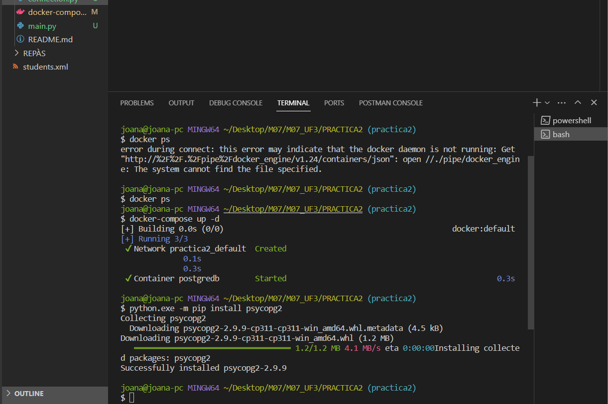
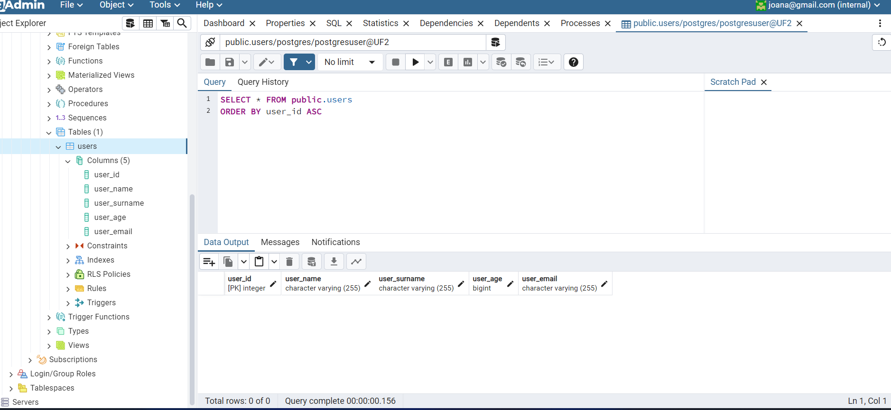
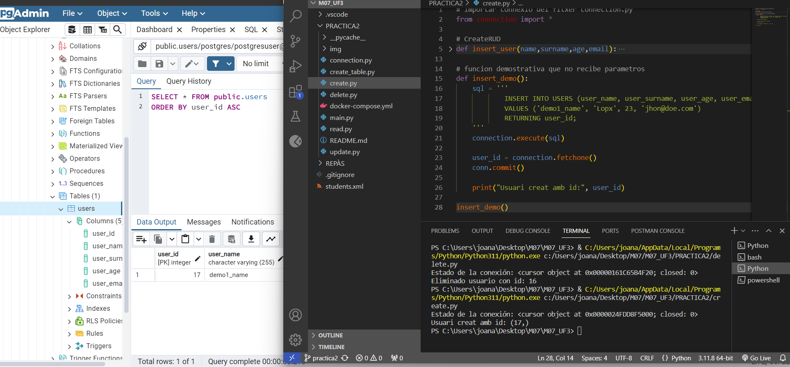
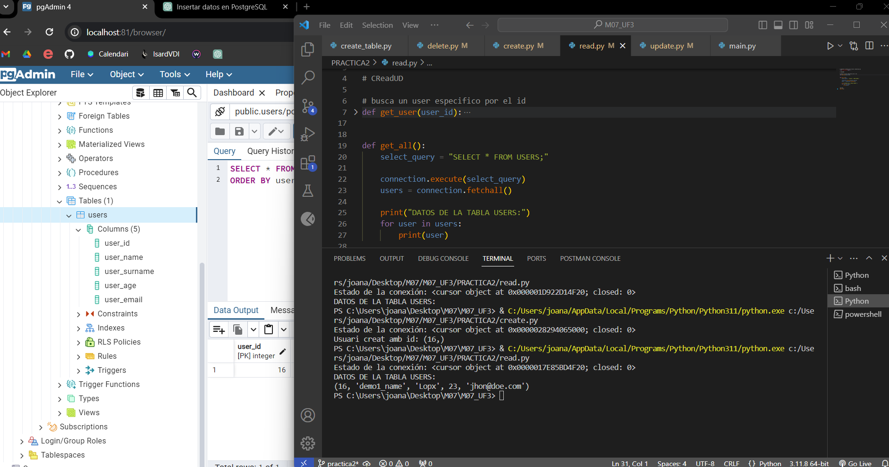
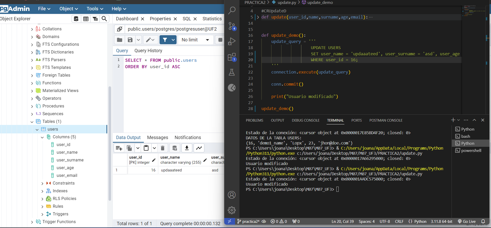
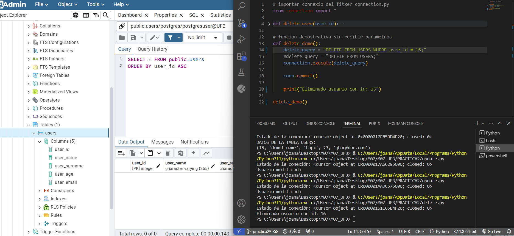

# UF3 Pràctica 2: Python + PostgreSQL
## Objectius
- Aprendre els mètodes per connectar a una BD
- Aprendre els mètodes per treballar amb querys
- Entendre les operacions CRUD

## Captures pantalla
### Instalación psycopg2 y levantar imagen docker

### Data Base vacía

### Insert new user

### Read user

### Update user

### Delete user
